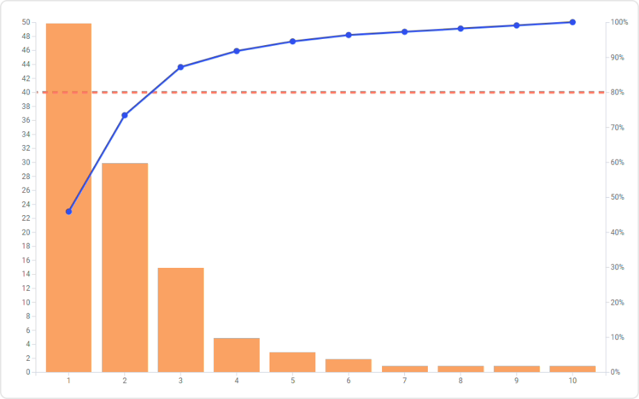

# Pareto Chart Mod for Spotfire®

Highlight the most important among a (typically large) set of factors by combining both bars and line charts, with individual values represented by bars in descending order, and the cumulative total represented by the line.

Pareto charts are useful when analyzing data where many courses of action are competing for attention, for instance indicating the frequency or causes of problems, as well as their cumulative impact. Pareto charts help to find the problems to prioritize in order to observe the greatest overall improvement.

*This mod was made possible by a great team of students of the Bachelor’s program Software Engineering and Management at Gothenburg University. Thanks to the project owners: Maja Linder, Bardha Ahmeti, Astrid Berntsson, Yuhan Li, Mohammad Zandkarimi, Navya Pulikandla Satyanarayanachetty*

## Installation & Use

[Download latest version](https://github.com/spotfiresoftware/spotfire-mod-pareto/releases)

The [Wiki](https://github.com/spotfiresoftware/spotfire-mod-pareto/wiki) contains step-by-step instruction on how to install and use this Mod in Spotfire®.

## Building the Project

In a terminal window:
- `npm install`
- `npm start`

In a new terminal window:
- `npm run server`

## About Mods for Spotfire®
-   [Spotfire Community Exchange](https://community.spotfire.com/files/): A safe and trusted place to discover ready-to-use Mods
-   [Developer documentation](https://spotfiresoftware.github.io/spotfire-mods/docs/): Introduction and tutorials for Mods developers
-   [Mods examples](https://github.com/TIBCOSoftware/spotfire-mods/): A public repository for examples projects
